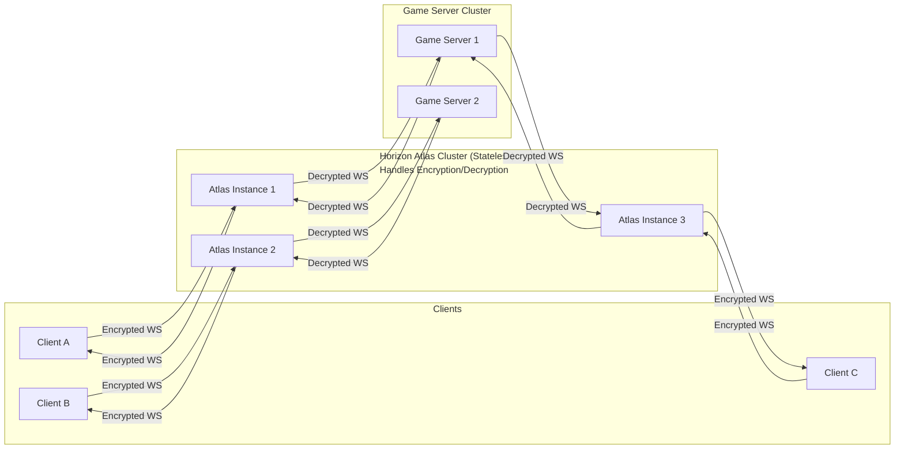

# Horizon Atlas

Horizon Atlas is a connection orchestrator for Horizon Game Server instances. Its primary goal is to manage the lifecycle of game servers, including starting, stopping, and monitoring them as players move throughout the game world.

## Goals

- **Dynamic Server Management:** Automatically start, stop, and monitor game server instances based on player movement and activity.
- **Seamless Player Experience:** As players approach new regions, Horizon Atlas prepares the corresponding game server if it is not already running, ensuring smooth transitions.
- **Efficient State Synchronization:** Preemptively serialize player state and begin syncing it via delta compression to the new game server as players move closer to a region.
- **WebSocket Proxy:** Act as a connection manager and proxy, routing player connections to the appropriate game server instance.
- **Scalability:** Enable large, persistent worlds by efficiently orchestrating multiple game server instances.

## Drafts and rambling

### Propose
The Horizon Atlas service operates in a cluster that maintains a state consisting of the bounds and connection information of all individual Horizon Game Server instances operating in the game. Atlas also integrates with the spatial object save system in order to figure out when a player connects which region they should be forwarded to. For instance:

Suppose a player is in solar system A. This is being run on node 5648. The player moves around a bit then leaves the game and they are only remembered in terms of their on-disk save state. Next time they join we recall their in-game coords from save and using the shard directory we find which node that area is now being run on. This allows us to avoid the assumption that one node will ***always*** be in charge of the ***same*** region of space in the game world.

### Inner Workings

### Secondary benefits
- Horizon Atlas is a mostly stateless proxy of websocket packets, this means we can run as many instances of it as needed to handle player traffic without needing to scale the backend game servers accordingly (eg 20 Atlas instances to 10 game servers for example)

  Because of this, Atlas is responsible for all encryption and decryption of WebSocket messages and traffic massively reducing the load on the game server itself allowing each instance to handle even more clients.

## Project Status

This project is in the early planning phase. There is currently no code or dependencies. The README will be updated as development progresses.

## License

To be determined.
