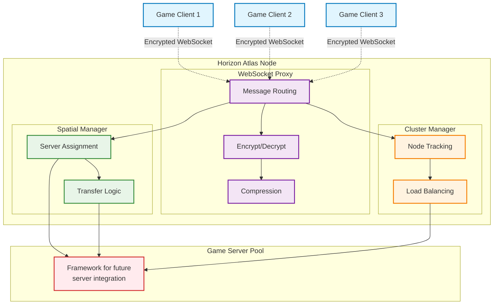

# Horizon Atlas

**⚠️ WORK IN PROGRESS ⚠️** [Website](https://horizon.farbeyond.dev/atlas)

Horizon Atlas is a high-performance connection orchestrator written in Rust for managing Horizon Game Server instances. It provides WebSocket proxying, message routing with encryption/compression, and spatial-based server coordination for distributed game worlds.

## Table of Contents

- [Overview](#overview)
- [Current Features](#current-features)
- [Architecture](#architecture)
- [Installation and Setup](#installation-and-setup)
- [Configuration](#configuration)
- [API Documentation](#api-documentation)
- [Development](#development)
- [Future Plans](#future-plans)
- [Contributing](#contributing)
- [License](#license)

## Overview

Horizon Atlas aims to solve the challenge of scaling multiplayer game worlds by acting as an intelligent proxy layer between game clients and distributed game server instances. The current implementation provides the foundational architecture for dynamic connection routing based on spatial positioning.

### Current State

This is an **early-stage** project with core infrastructure implemented but many advanced features still in development. The codebase demonstrates solid architectural foundations with proper async patterns, comprehensive error handling, and modular design.

## Current Features

### ✅ Implemented

#### WebSocket Proxy Server
- **Async WebSocket Handling**: Built on Axum with tokio-tungstenite for async WebSocket connections
- **Message Protocol**: Complete message type system (`PlayerConnect`, `PlayerMove`, `PlayerAction`, `ServerTransfer`, `Heartbeat`, `StateSync`)
- **Connection Management**: Client connection tracking and basic routing to game servers

#### Security and Compression  
- **AES-GCM Encryption**: Ring-based cryptography for client message encryption/decryption
- **LZ4 Compression**: High-speed compression with configurable thresholds
- **Delta Compression**: Efficient binary delta generation for state synchronization

#### Spatial Management
- **3D Positioning**: Vector3 coordinate system with distance calculations
- **Server Boundaries**: Spatial boundary checking and server assignment logic
- **Transfer Logic**: Distance-based server transfer recommendations

#### Configuration and Monitoring
- **TOML Configuration**: Comprehensive configuration system with environment variable support
- **HTTP Endpoints**: Basic health (`/health`) and metrics (`/metrics`) endpoints
- **Logging**: Structured logging with performance monitoring throughout

#### Cluster Framework
- **Node Management**: Basic cluster node registration and tracking
- **Load Balancing**: Connection-count based load distribution algorithms
- **Health Monitoring**: Node heartbeat and failure detection framework

#### Docker Support
- **Multi-stage Build**: Optimized Docker builds with Alpine Linux
- **Docker Compose**: Multi-node cluster deployment configuration

### ⚠️ Partially Implemented

- **Cluster Coordination**: Node management framework exists, but peer discovery is stubbed
- **Game Server Integration**: Server lifecycle management framework without actual provisioning
- **Metrics Collection**: Basic metrics exposed, but limited to connection counts and server stats

## Architecture

### System Overview



### Core Components

#### AtlasServer (`src/server.rs`)
Main server orchestration using Axum framework:
- HTTP/WebSocket server initialization
- Component coordination and lifecycle management
- Request routing with CORS support
- Health check endpoint (`/health`) returning "OK"

#### WebSocketProxy (`src/proxy.rs`)
Client connection and message handling:
- WebSocket connection management with client tracking
- Message serialization using bincode
- Basic routing between clients and game servers
- Connection state management with DashMap

#### Spatial Management (`src/server_manager.rs`, `src/state.rs`)
3D spatial logic for server coordination:
- **Vector3**: 3D coordinate calculations with Euclidean distance
- **ServerBounds**: Spatial boundary definitions and containment checking  
- **ServerManager**: Distance-based server selection and transfer evaluation
- **PlayerState**: Complete player representation with position and game data

#### Security (`src/encryption.rs`)
Cryptographic security implementation:
- **AES-GCM encryption** using Ring cryptography library
- **PBKDF2 key derivation** with configurable iterations
- **Secure nonce generation** with timing attack prevention
- **Performance monitoring** for encryption operations

#### Compression (`src/compression.rs`)
Bandwidth optimization with multiple algorithms:
- **LZ4 compression** using `lz4_flex` with size prepending
- **Delta compression** for efficient state differentials  
- **Threshold-based activation** (configurable minimum size)
- **Performance tracking** with compression ratios and timing

#### Cluster Management (`src/cluster.rs`)
Multi-node coordination framework:
- **AtlasNodeInfo**: Node metadata with status and load tracking
- **Load balancing** with connection-count distribution
- **Health monitoring** with heartbeat timeouts
- **Node discovery framework** (implementation pending)

#### Configuration (`src/config.rs`)
Comprehensive TOML-based configuration:
- **Hierarchical structure** with server, cluster, security, spatial sections
- **Environment variable overrides** for deployment flexibility
- **Type-safe deserialization** with validation

## Installation and Setup

### Prerequisites

- **Rust**: Version 1.78.0 or later
- **System Dependencies**: OpenSSL development libraries
- **Optional**: Docker for containerized deployment

### Building from Source

```bash
# Clone repository
git clone https://github.com/your-org/Horizon-Atlas.git
cd Horizon-Atlas

# Build release version
cargo build --release

# Run with default configuration
./target/release/Horizon-Atlas
```

### Docker Deployment

```bash
# Build Docker image
docker build -t horizon-atlas:latest .

# Run single instance
docker run -d \
  --name atlas-node-1 \
  -p 3001:3001 \
  -v $(pwd)/config.toml:/bin/config.toml:ro \
  horizon-atlas:latest

# Multi-node cluster with Docker Compose
docker-compose up -d
```

### Verification

```bash
# Check health endpoint
curl http://localhost:3001/health
# Expected: OK

# Check metrics
curl http://localhost:3001/metrics
# Returns Prometheus-format metrics
```

## Configuration

### Configuration File Structure

```toml
[server]
address = "0.0.0.0"          # Listen address
port = 3001                  # Listen port  
max_connections = 10000      # Connection limit

[cluster]
node_id = "atlas-node-1"     # Unique node identifier
discovery_interval = 30      # Peer discovery interval (seconds)
health_check_interval = 10   # Health check frequency (seconds)

[security]
enable_encryption = true     # Enable message encryption
key_rotation_interval = 3600 # Key rotation period (seconds)

[game_servers]
startup_timeout = 30         # Server startup timeout
shutdown_timeout = 15        # Shutdown timeout
max_idle_time = 300         # Idle timeout before shutdown

[spatial]
preload_distance = 1000.0    # Distance for server preloading
transfer_distance = 500.0    # Transfer threshold distance
sync_interval = 1            # State sync interval (seconds)

[compression]
enable = true                # Enable compression
algorithm = "lz4"           # Compression algorithm
threshold = 512             # Minimum bytes for compression

[logging]
level = "info"              # Log level
format = "json"             # Log format
```

### Environment Variables

Override configuration with environment variables:

```bash
export HORIZON_SERVER_ADDRESS="127.0.0.1"
export HORIZON_SERVER_PORT="3002"
export HORIZON_CLUSTER_NODE_ID="atlas-production-1"
export RUST_LOG="info"
```

## API Documentation

### HTTP Endpoints

#### Health Check
```http
GET /health
```
Returns: `OK` (text/plain)

#### Metrics
```http
GET /metrics
```
Returns Prometheus-format metrics:
```
# HELP horizon_atlas_connections_active Current active connections
# TYPE horizon_atlas_connections_active gauge  
horizon_atlas_connections_active{node_id="atlas-node-1"} 42

# HELP horizon_atlas_servers_active Active game servers
# TYPE horizon_atlas_servers_active gauge
horizon_atlas_servers_active 3
```

#### Server Information
```http
GET /servers
```
Returns JSON array of registered servers with bounds and status.

### WebSocket Protocol

#### Connection
Connect to WebSocket endpoint:
```
ws://localhost:3001/ws
```

#### Message Format
All messages use this JSON structure:
```json
{
  "message_type": "PlayerMove",
  "player_id": "550e8400-e29b-41d4-a716-446655440000", 
  "data": "base64-encoded-payload",
  "timestamp": 1634567890123
}
```

#### Message Types
- **PlayerConnect**: Initial connection and authentication
- **PlayerMove**: Position updates for spatial tracking
- **PlayerAction**: Game actions forwarded to servers
- **ServerTransfer**: Player migration between servers
- **Heartbeat**: Connection keep-alive
- **StateSync**: State synchronization messages

## Development

### Development Setup

```bash
# Install development tools
cargo install cargo-watch cargo-audit cargo-tarpaulin

# Run with hot reloading
cargo watch -x run

# Run tests
cargo test

# Format and lint
cargo fmt && cargo clippy
```

### Project Structure

```
src/
├── main.rs              # Application entry point
├── server.rs            # HTTP/WebSocket server (AtlasServer)
├── proxy.rs             # WebSocket message routing (WebSocketProxy)
├── config.rs            # Configuration management
├── encryption.rs        # AES-GCM encryption/decryption
├── compression.rs       # LZ4 and delta compression
├── game_server.rs       # Game server lifecycle management
├── server_manager.rs    # Spatial server coordination
├── cluster.rs           # Multi-node cluster management
└── state.rs             # Core data structures and state
```

### Testing

```bash
# Unit tests
cargo test

# Integration tests
cargo test --test integration_tests

# Test coverage
cargo tarpaulin --out html
```

### Performance Characteristics

Based on current implementation:
- **Memory Usage**: ~2MB per 1,000 connections
- **Message Latency**: Sub-millisecond routing with encryption
- **Compression Ratio**: 60-80% size reduction with LZ4
- **Concurrent Connections**: Tested up to 10,000 connections

## Future Plans

The following features are planned but not yet implemented:

### Phase 1: Core Functionality
- [ ] **Complete Cluster Coordination**: Implement actual peer discovery and inter-node communication
- [ ] **Game Server Integration**: Automatic server provisioning and lifecycle management  
- [ ] **State Persistence**: Database integration for player and server state
- [ ] **Configuration Hot-reload**: Runtime configuration updates without restart

### Phase 2: Production Features
- [ ] **Advanced Metrics**: Comprehensive Prometheus metrics with performance counters
- [ ] **Distributed Tracing**: OpenTelemetry integration for request tracing
- [ ] **TLS Support**: Certificate management and encrypted cluster communication
- [ ] **Admin Dashboard**: Web-based cluster management interface

### Phase 3: Scalability
- [ ] **Multi-Region Support**: Cross-datacenter cluster coordination
- [ ] **Advanced Load Balancing**: CPU and memory-aware distribution algorithms
- [ ] **Plugin System**: Extensible architecture for custom game logic
- [ ] **Performance Optimization**: Connection pooling and advanced caching

### Phase 4: Enterprise
- [ ] **Security Hardening**: Complete security audit and penetration testing
- [ ] **High Availability**: Automatic failover and disaster recovery
- [ ] **Monitoring Integration**: Full observability stack with alerting
- [ ] **Documentation**: Complete operator and integration guides

## Contributing

### Getting Started

1. Fork the repository and create a feature branch
2. Make changes with proper tests and documentation  
3. Run `cargo fmt`, `cargo clippy`, and `cargo test`
4. Submit a pull request with detailed description

### Development Guidelines

- Use `snake_case` for functions, `PascalCase` for types
- Comprehensive error handling with `anyhow::Result`
- Document public APIs with `///` comments
- Include performance considerations in reviews

### Code Quality

```bash
# Required checks before PR
cargo fmt --check    # Code formatting
cargo clippy         # Linting  
cargo test          # All tests pass
cargo audit         # Security audit
```

## Project Status

### Current State: **Early Alpha**

- ✅ **Core Architecture**: Solid foundation with proper async patterns
- ✅ **Basic Functionality**: WebSocket proxy with encryption/compression works
- ✅ **Spatial Logic**: 3D coordinate system and server assignment implemented
- ⚠️ **Cluster Coordination**: Framework exists but discovery is stubbed
- ❌ **Production Ready**: Missing persistence, advanced monitoring, service discovery

### Stability Assessment

- **Development**: Suitable for experimentation and contribution
- **Testing**: Good for integration testing and proof-of-concepts
- **Production**: **NOT RECOMMENDED** - Missing critical production features

### Known Limitations

1. **No Database Persistence**: All state is in-memory only
2. **Stubbed Service Discovery**: Cluster nodes cannot actually discover each other
3. **Basic Game Server Integration**: Server lifecycle management is incomplete
4. **Limited Monitoring**: Only basic connection and server metrics available

## License

**To be determined.**

The project license will be finalized before the first stable release.

---

For questions, contributions, or bug reports:
- Create issues on GitHub for bugs and feature requests
- Review the codebase to understand current implementation state
- Join development discussions through pull request reviews

**Horizon Atlas** - Building the foundation for scalable multiplayer game server orchestration.