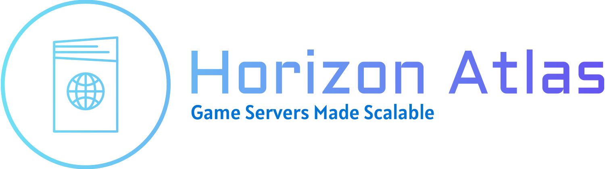

# Horizon Atlas

**⚠️ WORK IN PROGRESS ⚠️** [Website](https://horizon.farbeyond.dev/atlas)

Atlas is a clustered service that sits in front of the entire set of game servers. It provides a set of server for clients to connect to to route their messages to the correct game server. Atlas also handles all cryptographic operations for the game servers, ensuring that all communication is secure without overloading the game servers, and facilitating seamless cross-server transitions for objects and players in the game world which are crossing a boundary between servers.

In many respects Atlas operates as a websocket proxy, handling all incoming and outgoing messages between clients and game servers and listening to particular events that indicate the clients may be approaching a state where they need to switch servers. This allows Atlas to perform additional tasks such as rapid server transitions and predictive loading of instances.